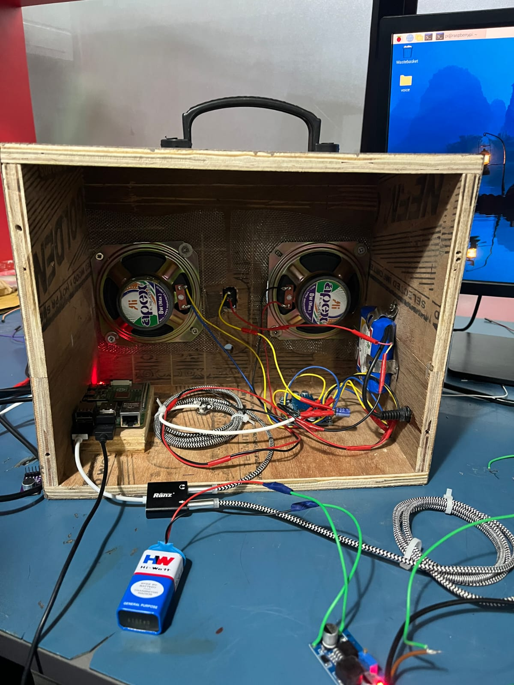

# Inventory Management AI - Voice Assistant

<div align="center">
  
</div>

A sophisticated **voice-enabled inventory management system** that leverages cutting-edge AI technologies to provide hands-free, conversational access to inventory data. Powered by advanced Speech-to-Text (STT), Text-to-Speech (TTS), and Retrieval-Augmented Generation (RAG) models, this system enables real-time spoken queries about inventory items, locations, and quantities.

## 📋 Table of Contents

- [Overview](#overview)
- [Features](#features)
- [Architecture](#architecture)
- [System Requirements](#system-requirements)
- [Installation](#installation)
- [Configuration](#configuration)
- [Usage](#usage)
- [Project Structure](#project-structure)
- [Core Components](#core-components)
- [Data Format](#data-format)
- [API Reference](#api-reference)
- [Performance Optimization](#performance-optimization)
- [Troubleshooting](#troubleshooting)
- [Contributing](#contributing)
- [Future Enhancements](#future-enhancements)

## 🎯 Overview

The Inventory Management AI system is designed to streamline inventory queries through a natural, conversational interface. Instead of manually searching through databases or reading spreadsheets, users can simply speak their questions to the system, which intelligently retrieves relevant inventory information and responds audibly.

### Key Use Cases

- **Warehouse Operations**: Quick lookup of component locations and quantities without stopping work
- **Maintenance Teams**: Voice-based access to spare part information while hands are occupied
- **Quality Control**: Rapid inventory verification during inspection processes
- **Logistics Management**: Real-time availability checks for shipping operations

## ✨ Features

### Core Intelligence
- **🎤 Wake Word Detection** - Automatic activation with "sandy" wake word detection using Vosk
- **🔊 Natural Language Processing** - Advanced speech-to-text transcription using Faster Whisper (base model)
- **📚 Semantic Search** - Intelligent vector-based retrieval using ChromaDB and HuggingFace embeddings
- **🤖 LLM Integration** - Contextual response generation using Ollama (Qwen2.5 0.5B model)
- **🎙️ Text-to-Speech** - Natural-sounding audio responses using Kokoro TTS model

### Technical Capabilities
- **Real-time Audio Processing** - Low-latency audio streaming and processing
- **Efficient Model Loading** - All models pre-loaded into memory for rapid response times
- **Vector Database Persistence** - ChromaDB for semantic similarity search over inventory data
- **Multi-modal I/O** - Audio input/output with error handling and fallback mechanisms
- **Comprehensive Logging** - Detailed logging for debugging and performance monitoring

## 🏗️ Architecture

```
┌─────────────────────────────────────────────────────────────┐
│                   VOICE ASSISTANT SYSTEM                     │
├─────────────────────────────────────────────────────────────┤
│                                                               │
│  ┌────────────────┐         ┌────────────────┐              │
│  │ Vosk (Wake)    │         │  PyAudio I/O   │              │
│  │  Word Engine   │         │   (16kHz 16b)  │              │
│  └────────────────┘         └────────────────┘              │
│         ▲                            ▲                       │
│         │                            │                       │
│   ┌─────┴────────────────────────────┴─────┐                │
│   │     Audio Stream Management            │                │
│   └─────┬────────────────────────────────┬─┘                │
│         │                                │                   │
│    ┌────▼────────┐            ┌──────────▼──────┐           │
│    │   STT       │            │      LLM        │           │
│    │   (Whisper) │            │   (Qwen2.5)     │           │
│    └────┬────────┘            └──────────┬──────┘           │
│         │                                │                   │
│    Query Text                      Response Text             │
│         │                                │                   │
│    ┌────▼──────────────────────────────┐│                  │
│    │   RAG Processor                   ││                  │
│    │   • Vector Store (Chroma)         ││                  │
│    │   • Embeddings (MiniLM)           ││                  │
│    │   • Semantic Search               ││                  │
│    └────┬──────────────────────────────┘│                  │
│         │                                │                   │
│      Context                           ┌─▼─────────────┐    │
│         └────────────────────────────►│     TTS       │    │
│                                        │   (Kokoro)    │    │
│                                        └──────────────┘    │
│                                            │               │
│                                        Audio Output         │
│                                            │               │
└────────────────────────────────────────────┼───────────────┘
                                             │
                                        Speaker Output
```

### Data Flow

1. **Activation**: System listens for "sandy" wake word
2. **Capture**: Records 5-second audio sample after wake word detection
3. **Transcription**: Converts audio to text using Faster Whisper
4. **Retrieval**: Searches vector database for relevant inventory items
5. **Generation**: LLM generates contextual response using retrieved context
6. **Synthesis**: Converts response text to speech using Kokoro
7. **Output**: Plays audio response to user

## 🔧 System Requirements

### Hardware
- **Processor**: Multi-core CPU (Intel i5/i7 or AMD equivalent recommended)
- **Memory**: Minimum 8GB RAM, 16GB+ recommended for optimal performance
- **Storage**: 10GB+ for models and databases
- **Audio**: Compatible audio input/output devices
- **OS**: Windows, macOS, or Linux

### Software
- **Python**: 3.11 or higher
- **pip/Poetry**: For dependency management

### GPU (Optional)
- **CUDA Capability**: Supported for faster Whisper transcription (if available)
- **MPS**: Not currently supported by Faster Whisper

## 📦 Installation

### Prerequisites

Ensure Python 3.11+ is installed:
```bash
python --version
```

### Step 1: Clone and Navigate

```bash
cd inventory-management-ai
```

### Step 2: Create Virtual Environment

```bash
# Using venv
python -m venv .venv

# Activate virtual environment
# On Windows:
.venv\Scripts\activate
# On macOS/Linux:
source .venv/bin/activate
```

### Step 3: Install Dependencies

The project uses Poetry for dependency management. Install all dependencies:

```bash
pip install poetry
poetry install
```

Alternatively, install directly with pip:

```bash
pip install -r requirements.txt
```

**Key Dependencies**:
- `faster-whisper` - Speech-to-text transcription
- `kokoro` - Text-to-speech synthesis
- `vosk` - Wake word detection
- `langchain-ollama` - LLM integration
- `chromadb` - Vector database
- `pandas` - Data processing
- `pyaudio` - Audio I/O
- `langchain-huggingface` - Embeddings

### Step 4: Download Required Models

The system uses several pre-trained models that need to be available:

**Vosk Model** (Wake word detection):
```bash
# Create models directory
mkdir models

# Download Vosk model
wget -O models/vosk-model.zip https://alphacephei.com/vosk/models/vosk-model-en-us-0.42-gigaspeech.zip
unzip models/vosk-model.zip -d models/
mv models/vosk-model-en-us-0.42-gigaspeech models/vosk-model
```

**Ollama Models** (LLM):
```bash
# Install Ollama from https://github.com/jmorganca/ollama
# Then pull the required model:
ollama pull qwen2.5:0.5b-instruct-q4_0
```

**Other Models** (Auto-downloaded on first run):
- Whisper Base Model - Downloads automatically via `faster-whisper`
- HuggingFace Embeddings - Auto-downloads on first use (all-MiniLM-L6-v2)
- Kokoro TTS - Auto-downloads on first use

### Step 5: Prepare Data

Create your inventory data in CSV format:

```bash
# Place your CSV file at:
data/data.csv
```

See [Data Format](#data-format) section for required structure.

## ⚙️ Configuration

### Data File Configuration

Update [main.py](main.py) paths if using different locations:

```python
csv_file_path = "data/data.csv"          # Inventory CSV file
chroma_directory = "chroma_db"           # Vector database storage
model_path = "models/vosk-model"         # Vosk model path
```

### Audio Configuration

Adjust audio settings in [main.py](main.py):

```python
RATE = 16000                             # Sample rate (Hz)
CHUNK_SIZE = 2048                        # Audio chunk size
RECORD_DURATION = 5                      # Recording duration (seconds)
```

### Model Configuration

#### Speech-to-Text (STT)
```python
whisper_transcriber = STT(
    model_size="base",                   # Options: tiny, base, small, medium, large
    device=None,                         # Auto-detect (cpu/cuda)
    compute_type=None,                   # Auto-select (int8/float16/float32)
    beam_size=1,                         # Beam search width (higher = more accurate)
    sample_rate=16000                    # Input audio sample rate
)
```

#### Text-to-Speech (TTS)
```python
tts_client = TTS(
    lang_code='a',                       # Language code
    voice="af_sky",                      # Voice options: af_sky, am_michael, etc.
    sample_rate=24000,                   # Output sample rate
    speed=1.0                            # Speed multiplier (0.25-4.0)
)
```

#### RAG Processor
```python
rag_processor = RAGProcessor(
    csv_file_path="data/data.csv",
    chroma_directory="chroma_db",
    embedding_model_name="all-MiniLM-L6-v2"  # HuggingFace embedding model
)
```

#### Large Language Model (LLM)
```python
llm = ChatOllama(
    model="qwen2.5:0.5b-instruct-q4_0",     # Model name from Ollama
    temperature=0.7,                        # Creativity level (0.0-1.0)
    top_p=0.9                               # Nucleus sampling parameter
)
```

## 🚀 Usage

### Basic Operation

Run the voice assistant:

```bash
python main.py
```

**Expected Output**:
```
Loading models into memory...
Loading RAG processor...
Loading LLM...
Loading Vosk model...
Loading optimized Whisper model...
Loading Kokoro TTS model into memory...
All models loaded successfully!

Initializing audio system...
Audio system initialized.
Vector database ready.
All systems initialized. Voice assistant is ready!

Listening for wake word ('sandy')...
```

### Interaction Flow

1. **Wait for System Ready**: All models pre-load at startup
2. **Speak the Wake Word**: Say "sandy" to activate
3. **Hear Confirmation**: System confirms wake word detection
4. **Ask Your Question**: Speak your inventory question (5-second maximum)
5. **Get Answer**: System responds audibly with inventory information

### Example Queries

```
"Where is the capacitor?"
→ "Component 1: Name: Capacitor - Location: Shelf A - Quantity: 50"

"How many resistors do we have?"
→ "Component 1: Name: Resistor - Location: Bin 3 - Quantity: 200"

"Find the IR sensor"
→ "Component 1: Name: IR Sensor - Location: Cabinet B - Quantity: 15"
```

### Exit

Press **Ctrl+C** to gracefully shutdown:
```bash
^CExiting program...
```

The system will properly close audio streams and release resources.

## 📁 Project Structure

```
inventory-management-ai/
├── main.py                          # Primary application entry point
├── README.md                        # This file
├── pyproject.toml                   # Poetry configuration
│                                    
├── data/
│   └── data.csv                     # Inventory database (CSV format)
│
├── src/
│   ├── __int__.py                   # Package initialization
│   ├── ragprocessor.py              # RAG system for vector search
│   ├── sttprocessor.py              # Speech-to-text wrapper
│   └── ttsprocessor.py              # Text-to-speech wrapper
│
└── models/
    ├── vosk-model/                  # Wake word detection model
    └── [auto-downloaded models]
```

## 🧠 Core Components

### 1. RAGProcessor (`src/ragprocessor.py`)

**Purpose**: Manages vector database operations and semantic search over inventory data.

**Key Methods**:

| Method | Purpose |
|--------|---------|
| `__init__()` | Initialize RAG processor with embeddings and vector store |
| `query_inventory(question)` | Search inventory using semantic similarity |
| `_rebuild_chroma_index()` | Rebuild vector database from CSV |
| `get_vector_store()` | Access underlying vector database |
| `rebuild_index()` | Manually trigger index rebuild |

**How It Works**:
1. Loads CSV inventory data
2. Converts rows to documents with metadata
3. Creates embeddings using HuggingFace `all-MiniLM-L6-v2`
4. Stores embeddings in ChromaDB vector database
5. Performs max marginal relevance search for queries
6. Returns top-k relevant inventory items

### 2. STT - Speech-to-Text (`src/sttprocessor.py`)

**Purpose**: Converts audio input to text using Faster Whisper.

**Key Methods**:

| Method | Purpose |
|--------|---------|
| `__init__()` | Initialize Whisper model with hardware detection |
| `transcribe(audio)` | Convert audio array to text |
| `get_config()` | Retrieve current configuration |

**Features**:
- Automatic hardware detection (CPU/GPU)
- Intelligent compute type selection
- Metadata extraction (confidence, language, processing time)
- VAD (Voice Activity Detection) optimizations

### 3. TTS - Text-to-Speech (`src/ttsprocessor.py`)

**Purpose**: Converts text responses to natural-sounding audio using Kokoro model.

**Key Methods**:

| Method | Purpose |
|--------|---------|
| `__init__()` | Load Kokoro pipeline into memory |
| `text_to_speech(text)` | Generate audio bytes from text |
| `get_status()` | Get processing status and metrics |

**Features**:
- In-memory model loading for fast synthesis
- Multiple voice options
- Configurable speech speed
- Automatic WAV file generation and cleanup

### 4. Main Application (`main.py`)

**Orchestration Flow**:

```python
1. Initialize all models and systems
2. Enter infinite loop:
   a. listen_for_wake_word() → Listen for "sandy"
   b. record_command() → Record 5-second audio
   c. query_inventory() → Search vector database
   d. speak() → Output response
3. Handle interrupts gracefully
```

**Key Functions**:

| Function | Purpose |
|----------|---------|
| `listen_for_wake_word()` | Detect "sandy" activation |
| `record_command(duration)` | Record audio sample |
| `query_inventory(question)` | Retrieve and format results |
| `speak(text)` | Synthesize and play audio |

## 📊 Data Format

### CSV Requirements

Inventory data must be in CSV format with the following columns:

```csv
Name of the component,Location,Quantity,Category,Price,Supplier,...
Capacitor,Shelf A,50,Electronic,0.25,Supplier X,...
Resistor,Bin 3,200,Electronic,0.10,Supplier Y,...
IR Sensor,Cabinet B,15,Sensor,5.99,Supplier Z,...
Transistor,Box 5,120,Electronic,0.50,Supplier X,...
```

**Required Columns**:
- `Name of the component` - Component identifier
- `Location` - Physical storage location
- `Quantity` - Available quantity

**Optional Columns**:
- Any additional columns are preserved in metadata
- Will be included in context window for LLM

**CSV Best Practices**:
- Use consistent naming conventions
- Standardize location names (e.g., "Shelf A" not "shelf a")
- Ensure quantity values are numeric
- Avoid special characters in component names
- Keep descriptions concise (under 200 chars)

## 📡 API Reference

### RAGProcessor API

```python
from src.ragprocessor import RAGProcessor

# Initialize
processor = RAGProcessor(
    csv_file_path="data/data.csv",
    chroma_directory="chroma_db",
    embedding_model_name="all-MiniLM-L6-v2"
)

# Query inventory
results = processor.query_inventory(
    question="Where is the capacitor?",
    k=2,              # Number of results
    fetch_k=3         # Fetch before filtering
)
print(results)

# Rebuild if CSV changes
processor.rebuild_index()

# Access vector store directly
vector_store = processor.get_vector_store()
```

### STT API

```python
from src.sttprocessor import STT
import numpy as np

# Initialize
stt = STT(
    model_size="base",
    device=None,      # Auto-detect
    compute_type=None, # Auto-select
    beam_size=1,
    sample_rate=16000
)

# Transcribe
audio_array = np.random.rand(16000)  # 1 second of audio
text, metadata = stt.transcribe(audio_array)
print(f"Transcribed: {text}")
print(f"Confidence: {metadata['confidence']}")

# Check configuration
config = stt.get_config()
print(config)
```

### TTS API

```python
from src.ttsprocessor import TTS

# Initialize
tts = TTS(
    lang_code='a',
    voice="af_sky",
    sample_rate=24000,
    speed=1.0
)

# Generate speech
audio_bytes = tts.text_to_speech("Where is the capacitor?")

# Get status
status = tts.get_status()
print(f"Processing time: {status['last_processing_time']:.2f}s")
```

## ⚡ Performance Optimization

### Memory Management

**Model Loading Strategy**:
- All models pre-loaded at startup
- Models persist in memory during execution
- Proper cleanup on shutdown

**Optimization Tips**:
```python
# Use smaller models for faster response
whisper_transcriber = STT(model_size="tiny")  # Instead of "large"

# Reduce beam size for faster transcription
whisper_transcriber = STT(beam_size=1)  # Instead of 5

# Use quantized models where available
llm = ChatOllama(model="qwen2.5:0.5b-instruct-q4_0")  # Quantized
```

### Audio Processing

**Latency Optimization**:
- 16kHz sample rate balances quality and speed
- 2048 chunk size optimizes buffer handling
- Single beam size provides real-time transcription

**Quality vs Speed Trade-offs**:
| Setting | Quality | Speed | Use Case |
|---------|---------|-------|----------|
| beam_size=1 | Good | Fast | Real-time |
| beam_size=3 | Very Good | Medium | Balanced |
| beam_size=5 | Excellent | Slow | Offline |

### Vector Database

**Search Optimization**:
- Max Marginal Relevance search reduces redundancy
- Fetch-k parameter balances speed and relevance
- Embeddings cached in ChromaDB

**Rebuild Triggers**:
- Automatic rebuild on first run
- Manual rebuild after CSV updates
- Automatic fallback if corruption detected

## 🔍 Troubleshooting

### Common Issues

#### 1. **Audio Input Not Working**

**Symptom**: "Could not open microphone"

**Solutions**:
```bash
# Check audio devices
python -c "import pyaudio; p = pyaudio.PyAudio(); [print(p.get_device_info_by_index(i)) for i in range(p.get_device_count())]"

# Test with specific device
# Edit main.py:
audio_stream = pa.open(rate=RATE, channels=1, format=pyaudio.paInt16, 
                       input=True, input_device_index=2)  # Change index
```

#### 2. **Vosk Model Not Found**

**Symptom**: "Model not found"

**Solutions**:
```bash
# Verify model path
ls models/vosk-model/

# If missing, download:
wget https://alphacephei.com/vosk/models/vosk-model-en-us-0.42-gigaspeech.zip
unzip vosk-model-en-us-0.42-gigaspeech.zip -d models/
```

#### 3. **Ollama Model Not Available**

**Symptom**: "Error connecting to Ollama"

**Solutions**:
```bash
# Ensure Ollama is running
ollama serve

# In another terminal, pull model:
ollama pull qwen2.5:0.5b-instruct-q4_0

# Verify installation
ollama list
```

#### 4. **ChromaDB Corrupted**

**Symptom**: "Error loading database"

**Solutions**:
```bash
# Delete corrupted database
rm -rf chroma_db/

# Restart application (will rebuild automatically)
python main.py
```

#### 5. **Out of Memory**

**Symptom**: Memory error after model loading

**Solutions**:
```python
# Use smaller models
whisper_transcriber = STT(model_size="tiny")
llm = ChatOllama(model="tinyllama:latest")  # Use smaller LLM

# Increase system swap (Linux/macOS)
# Reduce Chunk size
CHUNK_SIZE = 1024  # From 2048
```

#### 6. **Slow Transcription**

**Symptom**: Transcription takes >5 seconds

**Solutions**:
```python
# Reduce beam size
STT(beam_size=1)

# Use smaller model
STT(model_size="tiny")

# Enable GPU if available
STT(device="cuda", compute_type="float16")
```

### Debug Mode

Enable detailed logging:

```python
import logging
logging.basicConfig(level=logging.DEBUG)

# Or in main.py, change:
logging.basicConfig(level=logging.DEBUG)  # From INFO
```

### Performance Profiling

```python
import time

# Time individual components
start = time.time()
text, metadata = stt.transcribe(audio)
print(f"STT: {time.time() - start:.2f}s")

start = time.time()
results = processor.query_inventory(question)
print(f"RAG: {time.time() - start:.2f}s")

# Use the metadata returned by components
print(f"LLM processing time: {response_metadata}")
```

## 🤝 Contributing

Contributions are welcome! Please follow these guidelines:

### Development Setup

```bash
# Create feature branch
git checkout -b feature/your-feature-name

# Make changes and commit
git add .
git commit -m "feat: clear description of changes"

# Push and create pull request
git push origin feature/your-feature-name
```

### Code Standards

- Follow PEP 8 style guide
- Add docstrings to all functions
- Include type hints where applicable
- Add logging statements for debugging
- Write unit tests for new components

### Areas for Contribution

- Additional voice options
- Multiple language support
- Web dashboard for inventory visualization
- Database export capabilities
- Advanced RAG techniques
- Performance optimizations
- Documentation improvements

## 🔮 Future Enhancements

### Planned Features

1. **Multi-language Support**
   - Support for Spanish, French, Mandarin
   - Language detection and auto-switching
   - Region-specific voice variants

2. **Advanced RAG**
   - Hybrid search (semantic + keyword)
   - Multi-hop reasoning
   - Context window expansion
   - Dynamic retrieval parameters

3. **Web Interface**
   - REST API endpoints
   - Web dashboard for inventory management
   - Real-time analytics
   - Historical query logs

4. **Enhanced Audio**
   - Noise cancellation
   - Multiple microphone support
   - Speaker identification
   - Audio quality metrics

5. **Database Integration**
   - Direct SQL database connectivity
   - Real-time inventory sync
   - Transaction logging
   - Multi-user support

6. **Model Improvements**
   - Fine-tuned LLM for domain-specific language
   - Custom embeddings for inventory domain
   - Knowledge graph integration
   - Named entity recognition (NER)

7. **Performance**
   - Streaming audio processing
   - GPU optimization for all components
   - Model quantization advances
   - Edge device deployment

8. **Accessibility**
   - Screen reader support
   - Voice command customization
   - Accessibility logging
   - Multi-modal interfaces

## 📞 Support

For issues, questions, or suggestions:

1. Check [Troubleshooting](#troubleshooting) section
2. Review existing documentation
3. Create detailed issue report with:
   - System information
   - Error messages and logs
   - Steps to reproduce
   - Expected vs actual behavior

## 📄 License

This project is licensed under the MIT License - see the LICENSE file for details.

## 🙏 Acknowledgments

- **Faster Whisper**: OpenAI's Whisper model implementation
- **Kokoro**: Advanced TTS synthesis
- **ChromaDB**: Vector database for semantic search
- **LangChain**: Framework for LLM integration
- **Ollama**: Local LLM runtime
- **Vosk**: Lightweight speech recognition

---

**Last Updated**: February 2026  
**Version**: 0.1.0  
**Maintained by**: AI Labs Team
